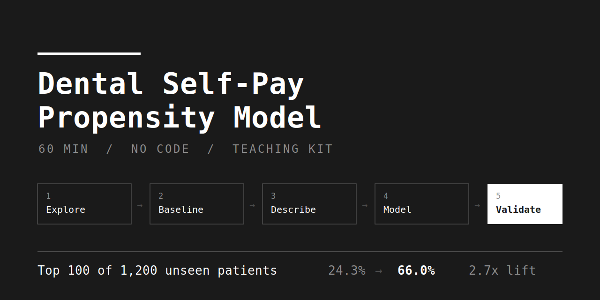
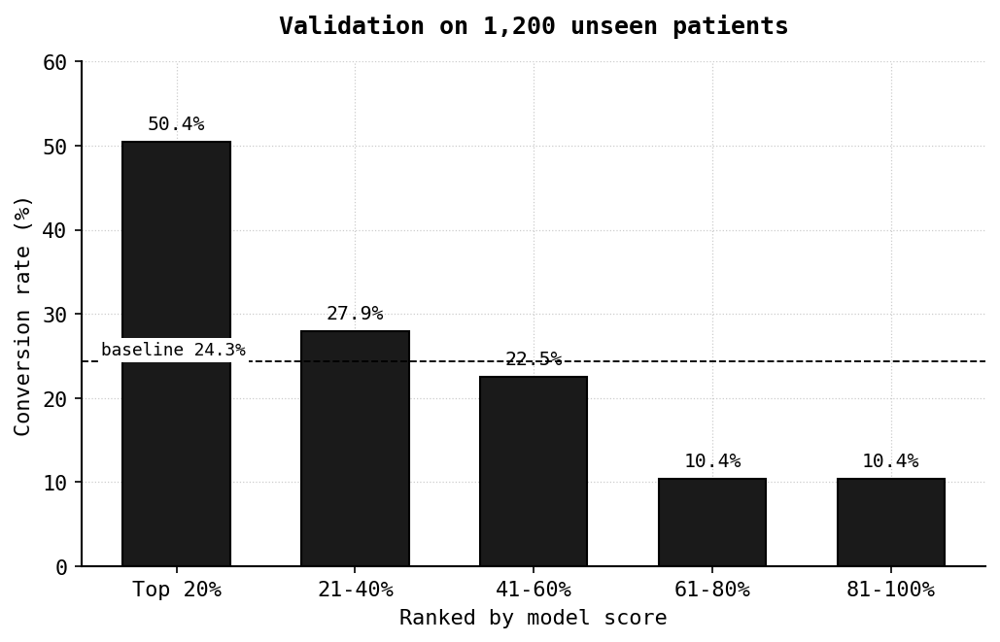

<p align="center">
  
</p>

# Dental Self-Pay Propensity Model — 牙科自費傾向模型

A 60-minute, no-code teaching kit for building and **validating** a propensity model.
Learners paste Traditional Chinese prompts into an AI assistant; the AI writes the Python.
Ships with two simulated datasets — one to train on, one held back to prove the model works on patients it has never seen.

一堂 60 分鐘的零基礎課。學員不寫程式，複製提示詞給 AI，AI 跑 Python，全班一起看結果。

[](https://codespaces.new/htlin222/dental-propensity-course?quickstart=1)

---

## 這堂課在做什麼

診所每個月只有 100 個諮詢名額，但回診病人有 1,200 個。**該優先找誰談自費療程？**

課程是一條直線，沒有支線：

> 有一組資料 → 提出問題 → 描述性統計 → 提出解決方法 → 驗證它可行

| 步驟 | 內容 | 分鐘 | 結果 |
|---|---|---|---|
| 1 | 認識並清理資料 | 10 | 1,206 → 1,200 列 |
| 2 | 提出問題、算現況 | 8 | 基準線 25.8% |
| 3 | 描述性統計 | 15 | 缺牙、LINE、醫師是關鍵 |
| 4 | 建立評分模型 | 15 | 輸入病人 → 得到機率 |
| 5 | **用全新病人驗證** | 10 | **前 100 人命中 66%，2.7 倍** |

第 5 步才是重點。模型在訓練時完全沒看過那 1,200 人。

<p align="center">
  
</p>

---

## 開課要用的東西

| 檔案 | 給誰 | 說明 |
|---|---|---|
| [`slides.pptx`](slides.pptx) | 投影 | 10 頁，黑白，含演講者備註 |
| [`course-guide.md`](course-guide.md) | 講師 | 每一步的提示詞、預期數字、話術 |
| [`prompt-cards.md`](prompt-cards.md) | 學員 | 複製貼上用 |
| [`data/dental_patients.csv`](data/dental_patients.csv) | 學員 | 一開始就發 |
| [`data/dental_patients_new.csv`](data/dental_patients_new.csv) | 學員 | **第 5 步才發** |

## 講師事前驗證

跑一次就會印出課堂上會出現的所有數字。

**在 Codespaces**（不用裝任何東西）：按上面的 badge，或直接開這個網址

```
https://codespaces.new/htlin222/dental-propensity-course?quickstart=1
```

等容器起來（第一次約 1–2 分鐘），然後

```bash
python analysis/run_all.py
```

`?quickstart=1` 會直接在瀏覽器版 VS Code 開啟，而且如果你之前開過，
它會問要不要接續原本那個，不會每次都新建一個。

**在自己電腦**：

```bash
git clone https://github.com/htlin222/dental-propensity-course.git
cd dental-propensity-course
pip install -r analysis/requirements.txt
python analysis/run_all.py
```

圖表會寫到 `analysis/outputs/`。學員用 AI 跑出來的結果應該跟這裡一致；
前處理寫法不同會有 ±1–2 個百分點的差異，方向一致就是對的。

---

## 資料

兩份都是電腦生成的模擬資料，**不是真實病歷**。

| 檔案 | 列數 | 用途 |
|---|---|---|
| `dental_patients.csv` | 1,206 | 建模。故意弄髒：6 筆重複列、8 筆 `age=999`、55 筆 `perio_depth` 缺失 |
| `dental_patients_new.csv` | 1,200 | 驗證。乾淨，模型從未看過 |

目標欄位是 `selfpay_next90`：未來 90 天有沒有做自費療程。
生成方式與埋在資料裡的真實效應寫在 [`analysis/make_data.py`](analysis/make_data.py)（講師版，會劇透）。

> 課堂上會講：回去之後不要把真實病歷直接上傳給 AI。要用自家資料，
> 至少先移除姓名、病歷號、身分證字號、生日（改年齡）、電話、詳細地址（改行政區）。

---

## 專案結構

```
.
├── slides.pptx              投影片
├── course-guide.md          講師手冊
├── prompt-cards.md          學員提示詞卡
├── data/                    兩份模擬資料
├── analysis/
│   ├── run_all.py           五步分析，一次跑完
│   ├── make_data.py         資料生成腳本（含答案）
│   └── outputs/             已跑好的圖表
└── .devcontainer/           Codespaces 設定
```

## 方法

`scikit-learn` 的 logistic regression：數值欄位標準化、類別欄位 one-hot。
在第一份資料上訓練，在第二份完全獨立的資料上評估，AUC 0.724。

選 logistic regression 而不是 XGBoost，是因為它的係數可以直接攤開來看，
跟第 3 步用肉眼看到的結果對照 —— 這對教學比多兩個百分點的準確度重要。

## 授權

MIT。資料為模擬生成，可自由使用與修改。

---

**Keywords**: propensity model, propensity score, logistic regression, scikit-learn,
healthcare analytics, dental clinic, patient targeting, lead scoring, lift chart,
holdout validation, no-code data science, AI-assisted learning, teaching material,
Traditional Chinese, 傾向模型, 邏輯迴歸, 牙科, 自費療程, 資料分析教學, 零基礎
